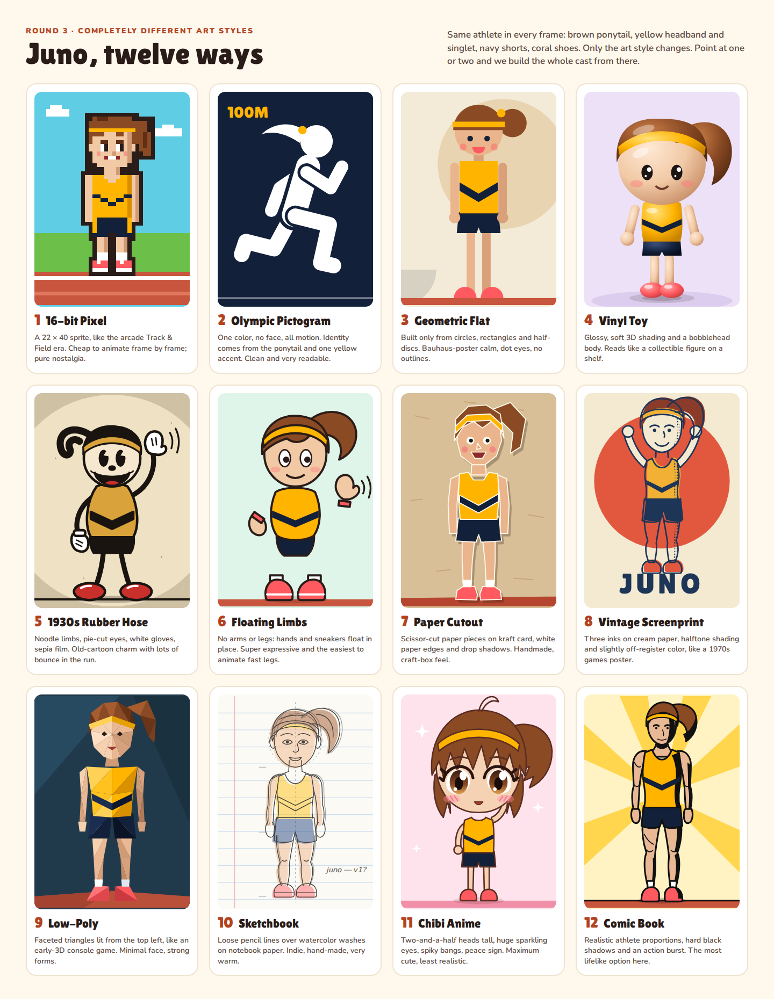
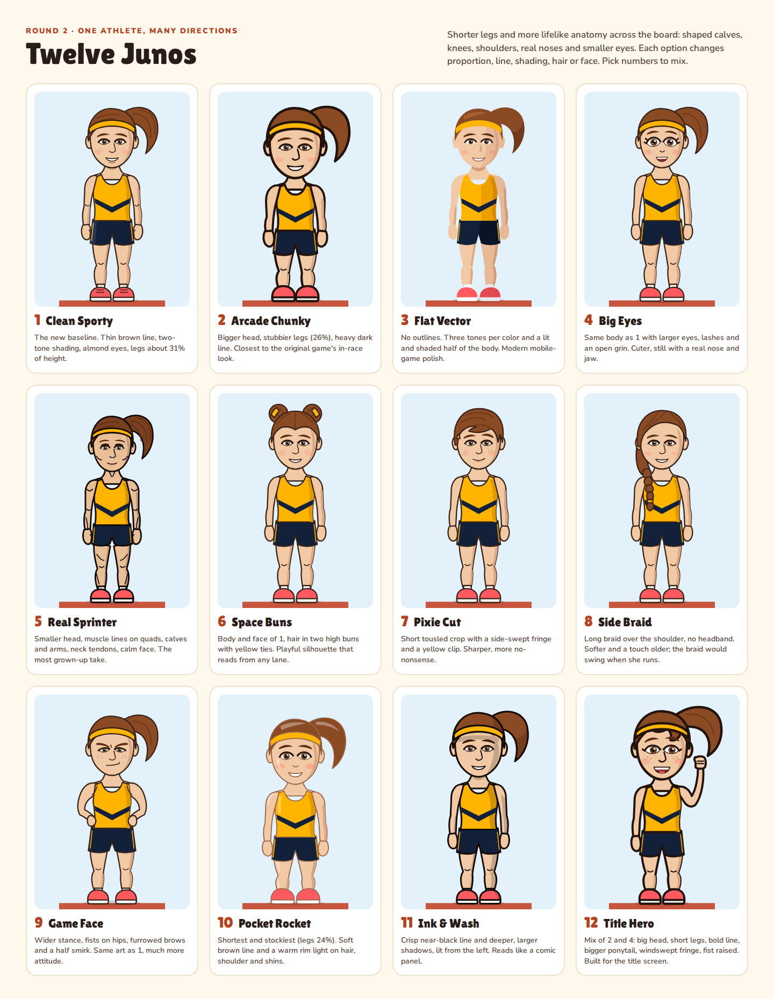
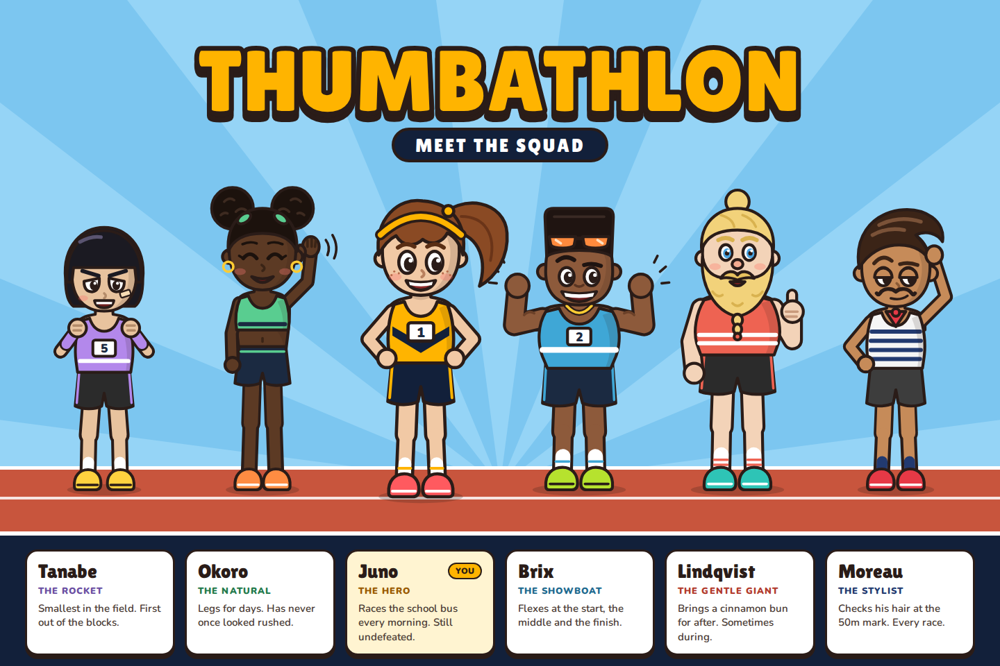
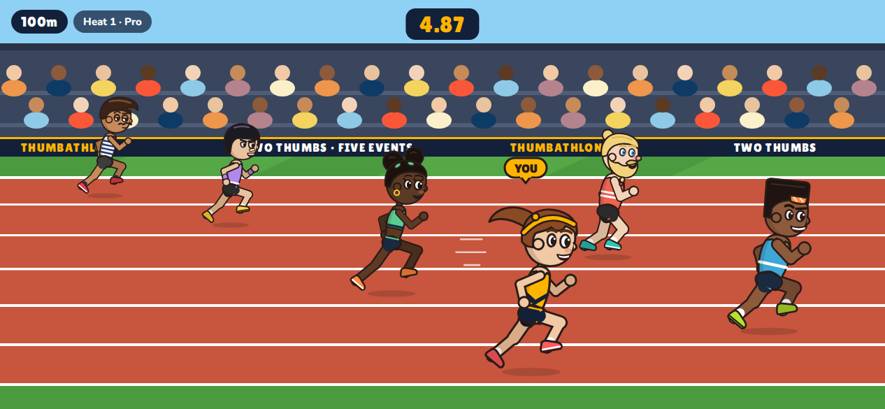
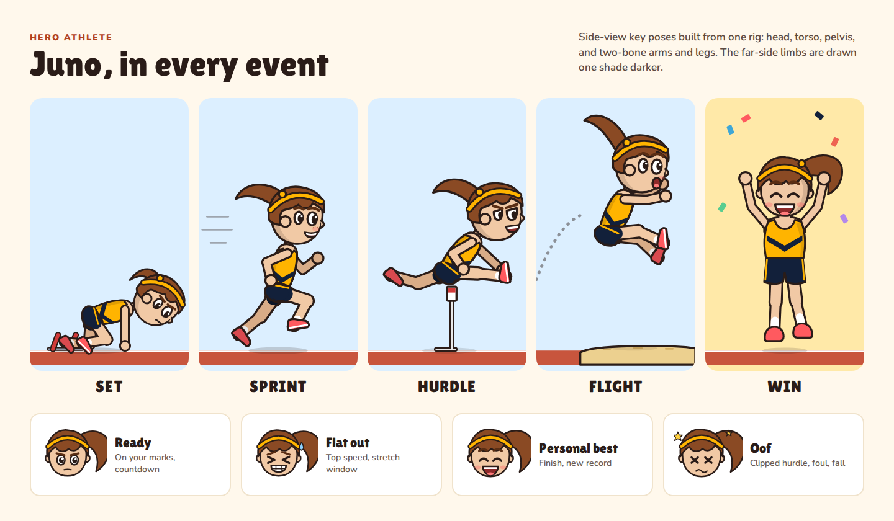
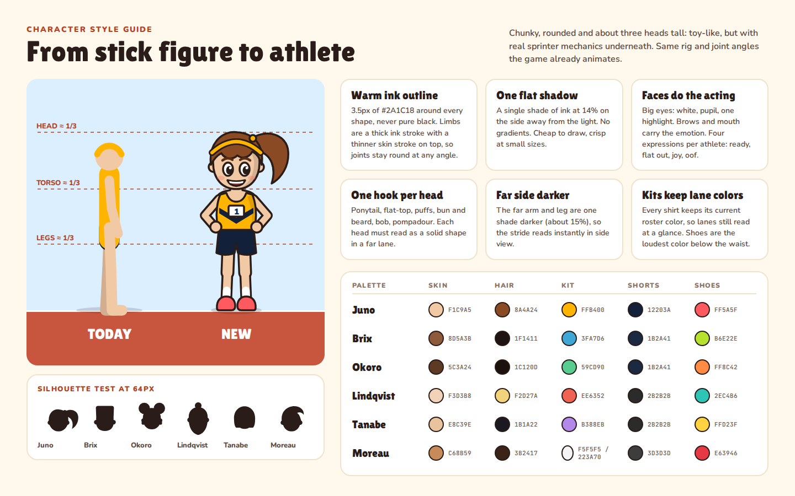

# Character redesign

Replaces the placeholder stick figures (`src/athletes/stickFigure.js`) with
chunky, rounded cartoon athletes in the spirit of the original Playman Track &
Field. The designs are original: no Playman characters, names or kits are used.

The editable source is a design canvas:
https://claude.ai/artifact/CM3NmVhpa4QoeGVXT4pyCe
(it's private until you share it from the page's Share menu).

| Board | Preview |
| --- | --- |
| Round 3: Juno in twelve different art styles |  |
| Round 2: twelve Juno options (shorter legs, more lifelike) |  |
| Meet the squad (title screen) |  |
| In-race, 100m (landscape phone) |  |
| Juno pose sheet |  |
| Style guide |  |

## The squad

Names and shirt colors match `src/athletes/roster.js`, so lanes still read the same.

| Athlete | Role | Silhouette hook | Skin | Hair | Kit | Shorts | Shoes |
| --- | --- | --- | --- | --- | --- | --- | --- |
| Juno (you) | The Hero | high ponytail + yellow headband | `#F1C9A5` | `#8A4A24` | `#FFB400` | `#12203A` | `#FF5A5F` |
| Brix | The Showboat | flat-top, shades pushed up, gold chain | `#8D5A3B` | `#1F1411` | `#3FA7D6` | `#1B2A41` | `#B6E22E` |
| Okoro | The Natural | two afro puffs, hoops, longest legs | `#5C3A24` | `#1C120D` | `#59CD90` | `#1B2A41` | `#FF8C42` |
| Lindqvist | The Gentle Giant | man-bun, braided beard, biggest build | `#F3D3B8` | `#F2D27A` | `#EE6352` | `#2B2B2B` | `#2EC4B6` |
| Tanabe | The Rocket | blunt bob, wristbands, plaster, smallest | `#E8C39E` | `#1B1A22` | `#B388EB` | `#2B2B2B` | `#FFD23F` |
| Moreau | The Stylist | pompadour, curled mustache, Breton stripes | `#C68B59` | `#3B2417` | `#F5F5F5` / `#223A70` | `#3D3D3D` | `#E63946` |

## Style rules

- **Proportions:** about three heads tall (head ≈ torso ≈ legs). The head is
  roughly 0.3 of total height, against 0.17 on the stick figure.
- **Ink:** 3.5px warm outline `#2A1C18` at 1×, never pure black. Limbs are a
  thick ink stroke with a thinner skin stroke on top (round caps and joins), so
  joints stay clean at any angle.
- **Shading:** one flat shade, ink at 14% opacity, on the side away from the
  light. No gradients.
- **Faces:** white eye + pupil + one highlight. Brows and mouth carry four
  expressions: ready, flat out, joy (personal best), oof (clip, foul, fall).
- **Far side darker:** far arm and leg are about 15% darker. The current
  `drawFigure` does the same with 30%; the outlines make a lighter step enough.

## Rig (for implementation later)

The side view uses the same structure as `drawFigure`: hip → two-bone legs
with a shoe on the ankle, torso rotated by `lean`, two-bone arms from the
shoulder, and the head on the neck. Draw order is unchanged: far leg, far arm,
torso, pelvis, near leg, near arm, head. So the existing `POSES` and
`lerpPose` blending can drive the new art. Only the part drawing and the
segment lengths change.

Segment lengths used in the designs, as a fraction of standing height H:

| Part | Stick figure | New |
| --- | --- | --- |
| thigh | 0.25 | 0.16 |
| shin (to ankle) | 0.25 | 0.15 |
| torso (hip to neck) | 0.32 | 0.24 |
| upper arm / forearm | 0.17 / 0.16 | 0.12 / 0.09 |
| head diameter | 0.17 | 0.28 |

Shorter limbs change `THIGH_L`/`SHIN_L` and the hip heights in the leg IK
(`legIK`, `BLOCK_FEET`), so the block and set poses need a re-tune when this
lands.
